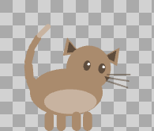
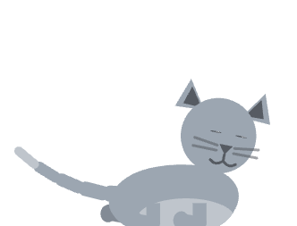

# my-pets

One or several autonomous animated cats that live on your macOS desktop. They aren't
widgets — they walk around your screen, stand on top of your application windows, chase
your cursor, get bored when you ignore them, follow and tumble with each other, wander
between monitors, and fall asleep when you stop typing. Every few seconds each one decides
for itself what to do next.

<p align="left">
  
  
</p>

*Awake (tail up, blinking, whiskers) and asleep (flattened, eyes closed, floating Z). The
pet is drawn procedurally in code — there are no image assets.*

---

## Status

**Working end to end on macOS.** You can clone, install, run, and a cat appears on your
desktop and starts living there. Built and verified on macOS 26 (Darwin 25.5), Apple
Silicon, Node 25, Electron 33.

| Area | State |
|---|---|
| Transparent, click-through, always-on-top overlay | ✅ Done |
| Procedural cat drawn in Canvas2D: 12 animation states, smooth blending | ✅ Done |
| Utility-AI behaviour engine (needs → mood → action), 16 actions | ✅ Done |
| 7 personalities, seeded traits + per-pet coat colour | ✅ Done |
| Desktop awareness: stands on, jumps between, and climbs real windows | ✅ Done |
| Cursor chasing, idle detection, sleep, battery awareness | ✅ Done |
| **Multiple pets** that follow, play and sleep in a pile | ✅ Done |
| **Multi-monitor**: one overlay per display, pets walk between screens | ✅ Done |
| Long-term memory (favourite apps, daily routine, your name, chat history) | ✅ Done |
| Speech bubble + conversation | ✅ Done (LLM optional, off by default) |
| Menu-bar tray: number of pets, size, sleep-on-windows, reset, quit | ✅ Done |
| Zero macOS permission prompts | ✅ Done |
| Audio / music reactivity | ❌ Not built — see Roadmap |
| Windows + Linux | ❌ macOS only |

---

## Requirements

- **macOS** (the window layer and the `deskscan` helper are macOS-specific)
- **Node.js 20+** (developed on 25.9)
- **Xcode Command Line Tools** — provides `swiftc`, needed to build the window-scanner
  helper. Install with `xcode-select --install`

## Setup

```bash
git clone git@github.com:pm-2001/my-pets.git
cd my-pets
npm install
npm start
```

`npm start` compiles the Swift helper, generates the tray icon, bundles everything, and
launches the app. A cat appears at the bottom of your screen and a small cat icon appears
in your menu bar. **Quit from the menu-bar icon** — there is no dock icon and no window
to close.

### Scripts

| Command | What it does |
|---|---|
| `npm start` | Full build, then run |
| `npm run dev` | Vite dev server + Electron with hot reload for the renderer |
| `npm run build` | Build everything into `dist/` and `dist-electron/` |
| `npm run typecheck` | `tsc --noEmit` across main, preload and renderer |
| `npm run native` | Rebuild just the Swift helper and the tray icon |

---

## No permission prompts

This was a deliberate design constraint: the app asks for **nothing** on first run — no
Accessibility, no Screen Recording, no input monitoring. Everything it perceives comes
from APIs that macOS grants freely:

| What it senses | How | Permission |
|---|---|---|
| Cursor position | Electron `screen.getCursorScreenPoint()` | none |
| Whether you're active | `powerMonitor.getSystemIdleTime()` | none |
| Window positions and sizes | `CGWindowListCopyWindowInfo` via a small Swift helper | none |
| Battery level | `pmset -g batt` | none |

The cost of that choice: window **titles** are unavailable (macOS redacts `kCGWindowName`
without Screen Recording), so the pet knows it is standing on "Terminal" but not which
file you have open. It also can't see individual keystrokes — only whether you are active.
Both are acceptable trades for an app that just works when you open it.

---

## Architecture

```
electron/                  main process (Node)
  main.ts                  lifecycle, tray, IPC, pet↔display assignment, memory authority
  overlay.ts               one transparent always-on-top window per display
  sensors.ts               perception: cursor, idle, windows, power
  store.ts                 atomic JSON persistence for the pet array + settings
  chat.ts                  Anthropic API + local voice; name learning; routine detection
  preload.ts               the entire renderer-facing API surface
  native/deskscan.swift    streams window geometry as JSON lines

src/
  shared/types.ts          the contract between the two processes
  world/desktop.ts         the desktop as a platformer level (ledges, occlusion, displays)
  brain/
    personality.ts         traits + seeded per-pet variation, coat palette
    needs.ts               internal drives and mood derivation
    actions.ts             utility AI: scoring, cooldowns, recency, momentum, social drives
    pet.ts                 the entity: physics, action execution, pet-to-pet awareness
  render/
    cat.ts                 procedural cat geometry, drawn in Canvas2D
    stage.ts               per-display render loop: many pets, dirty-rect clears, hit-testing
  ui/Bubble.tsx            speech bubble (DOM, not canvas)
  App.tsx                  wiring: assignment, per-pet bubble + chat
```

### Multiple pets and multiple monitors

Main is the authority. It holds the array of pets (persisted) and a map of which
display each one currently lives on, and it spins up **one overlay window per display**.
Each window simulates only the pets assigned to it, so pets on the same screen are aware
of one another — they share a `Desktop` and each `Pet.update` is handed the others — while
the render cost stays per-display.

When a pet walks off a display edge that has another screen beyond it, its window ships
the pet's live state to main, which routes it to the neighbour's window. Because every
coordinate is global (see the contract note in `types.ts`), the receiving window simply
keeps simulating from the same numbers — the pet does not skip or reset, it just crosses
the seam. Displays stacked vertically are treated as hard walls; side-by-side hand-off is
the common case and the one that is wired.

Main is also the single writer of pet memory, so N windows never race over the file, and
long-term learning lives in one place.

### How the behaviour works

Nothing is scripted. Three layers feed each other:

1. **Needs** (`needs.ts`) — `sleepiness`, `boredom`, `curiosity`, `loneliness`,
   `excitement`, each 0–100, drifting continuously. Personality sets the rates: a lazy
   pet's sleepiness climbs four times faster than an energetic one's.

2. **Actions** (`actions.ts`) — each of the 16 actions scores itself against the current
   needs, and the highest score wins. There is no state machine saying which action may
   follow which. Two are social — `follow` (trail the nearest companion) and `play` (tumble
   with one that is close) — and score only when another pet shares the display, so a lone
   pet behaves exactly as before. One is `climb` (scale a tall window's side), gated on
   boldness and energy so a brave cat scales walls a timid one never would.

3. **Execution** (`pet.ts`) — the winning action becomes velocity and an animation state,
   then gravity and surface collision are applied.

A naive "highest score wins" loop oscillates between two actions and reads as *more*
robotic than a script, so four mechanisms guard against it: per-action **cooldowns**, a
sliding **recency penalty**, **momentum** (the running action gets a bonus until its
minimum duration elapses), and score-scaled **noise**.

### The desktop as a platformer

`desktop.ts` treats every on-screen window's top edge as a standable ledge, with the
bottom of the work area as the floor. Occlusion is handled properly — a ledge belonging to
a buried window is not standable where another window covers it, so the pet never appears
to stand on thin air in front of whatever is actually on top. Stage Manager's strip
thumbnails are filtered out in the Swift helper, since they are real layer-0 windows that
would otherwise become fake platforms.

A single hop only reaches about 260px, so a tall window whose title bar sits high above the
floor is out of jump range. For those the pet **climbs**: `desktop.ts` also reports a
window's vertical **edges** as climbable walls (when the top is above jump range but the
side reaches down near the pet and the top is not occluded), and the `climb` behaviour walks
to the foot of the wall, grips it, and scales it — gravity suspended — until it mounts the
title bar. It is the only way onto a large maximised window, and it's personality-gated so
timid cats stay low.

### Conversation

Off by default. With **AI conversation** ticked in the tray menu, clicking the pet opens a
speech bubble backed by the Anthropic API (`claude-opus-5`, thinking disabled and effort
`low` for latency, server-side refusal fallbacks enabled). It picks up credentials the
standard way — `ANTHROPIC_API_KEY`, `ANTHROPIC_AUTH_TOKEN`, or an `ant auth login`
profile. No key is ever stored by this app.

With it off — or if no credentials are found, or the API errors — the pet falls back to a
local personality-driven voice that responds instantly. That fallback is the default on
purpose: a pet that always says something charming immediately beats one that waits two
seconds for a network round trip.

### Commands

The bubble is not only for talking — the pet also acts on what you type. A message is
matched against a small keyword table (`parseIntent` in `App.tsx`) and, if it names an
activity, the pet does it immediately with a snappy acknowledgement and no network round
trip: **jump**, **come here**, **sit**, **sleep**, **wake up**, **dance**, **run**,
**climb**, **explore**, **stretch**, **play**, **scratch**, **look**, **walk**, **stop**.
Anything that is not a command still gets a spoken reply, and the pet perks up whenever you
talk to it. Because it is keyword-based, it works with the local voice too — no API key
needed to boss your cat around.

---

## Performance

Measured on this machine (Apple Silicon, 120Hz display) as CPU-time deltas over 60-second
windows. **Percentages are of one core**, which is how `top` and `ps` report on macOS — so
8% of one core is roughly 1% of an 8-core machine. The figures below are for a **single pet
on one display**; the WebGL numbers predate the move to Canvas2D described further down,
which removed the largest term. A second display adds roughly another window's worth of
compositing cost, and extra pets on a display are cheap by comparison (a few more small
dirty-rect redraws).

| State | CPU (of one core) |
|---|---|
| Pet asleep, machine idle | ~8% (Pixi era; lower on Canvas2D) |
| Pet sitting, user present | ~8% (Pixi era; lower on Canvas2D) |
| Swift `deskscan` helper | ~0.0% (2.8 MB RSS) |
| Main process | ~0.3% |

Optimisations already applied, in order of what they were worth:

- **Split the IPC channels.** Window layout, displays and power go on a slow channel that
  only fires on change; only the cursor and idle time go at tick rate. Previously the full
  window list was re-serialised 30 times a second. Main process: 3.5% → 0.3%.
- **Adaptive cursor polling.** 30Hz only while the mouse is actually moving; 10Hz when
  parked, 4Hz when you're away, snapping back instantly on movement.
- **Canvas2D instead of WebGL.** The renderer used to be Pixi. Profiling bisected the idle
  cost to something no tuning in the codebase could fix: **a live WebGL context inside a
  transparent Electron window has a large, frame-rate-independent cost** — a bare window
  with a Pixi canvas rendering *twice a second* cost about as much as the entire finished
  app. Canvas2D rasterises this little sprite several times more cheaply per frame and has
  no such standing context cost, so the whole render layer moved to immediate-mode drawing.
  The pose-based animation system carried over unchanged; only `cat.ts` was rewritten from
  Pixi `Graphics` to `ctx` paths.
- **Dirty-rect clearing.** Supporting several pets anywhere on the screen rules out the old
  trick of a tiny canvas moved by a compositor transform, so the canvas now spans the whole
  window — but each frame clears and redraws only the handful of pixels each pet actually
  touches (its padded bounding box), not the screen.
- **Frame-rate throttling by motion, not by action.** A pet spends most of its life in
  static poses where only breathing and blinking move; those run at 8–12fps and only actual
  movement gets 24–30. With several pets the rate follows the liveliest one, so a single
  running cat lifts its display while the rest doze.
- **A hand-rolled loop.** Pixi's ticker requested an animation frame every display refresh —
  120 wakeups/sec on a ProMotion panel regardless of the animation rate. The loop is a timer
  that sets the pace plus one vsync-aligned rAF per frame, so wakeups scale with the frame
  rate actually wanted.

### The honest caveat

A transparent, always-on-top overlay still carries a per-frame compositing cost that scales
with the size of the window being recomposited, and that is now one window per display.
Dropping WebGL removed the dominant term; the dirty-rect clears and aggressive fps
throttling keep the rest small, but an idle machine with the overlay up is not free. The
remaining lever, unimplemented, is a small window that *moves* (as Shimeji and Desktop Goose
do) instead of a fullscreen overlay — it would cut most of the compositing cost at the price
of window-move jitter and more work for the bubble and hit-testing.

---

## Dev tooling

A transparent always-on-top window can't be inspected with a normal screenshot, so there
are two env-gated hooks:

```bash
# Per-frame stats (actual fps vs the cap, current action, idle time, window count)
PET_DEBUG=1 npx electron .

# Capture the window's own output — alpha included, no Screen Recording permission needed
PET_CAPTURE=/tmp/pet.png PET_CAPTURE_DELAY=6 PET_CAPTURE_QUIT=1 npx electron .

# Force every pet to hold one pose, for inspecting the art (e.g. the climb pose)
PET_POSE=climb npx electron .
```

Pet state lives in `~/Library/Application Support/desktop-pet/` (`memory.json`,
`settings.json`). `memory.json` holds a `pets` array — one entry per pet — and a
pre-multi-pet file is migrated to it automatically. Delete them, or use **Forget
everything…** in the tray menu, to be reborn with new personalities and coats.

---

## Known limitations

- **macOS only.** The overlay flags, `CGWindowList` and the Swift helper are all
  platform-specific. Windows would need `EnumWindows` + layered windows; Linux works on
  X11 but is largely impossible on GNOME Wayland, which forbids absolute window
  positioning and window enumeration.
- **Multi-monitor hand-off is horizontal.** Side-by-side displays are wired; a pet walks
  from one to the next and back. Displays stacked vertically are treated as hard walls
  rather than handed across — most setups are side-by-side, and that is the case that is
  built.
- **Pets are aware of each other only on the same display.** Two cats on one screen follow
  and play; a cat on another monitor is out of sight until one wanders across.
- **Window titles are unavailable** by design — see the permissions section.
- **Fullscreen apps hide the pet.** The window sits at `screen-saver` level with
  `visibleOnFullScreen`, which covers most cases, but true exclusive-fullscreen apps will
  cover it.
- **Not code-signed.** Running a distributable build on another Mac would need signing and
  notarisation; running from source as documented here does not.
- **A transparent overlay is not free.** See Performance above — one window per display.

---

## Roadmap

Done since the first cut: **Canvas2D renderer**, **multiple pets** (following, playing,
sleeping in a pile), **multi-monitor** with edge hand-off, and the memory half of **richer
memory** — the pet now learns your name from conversation and notices your daily routine
("isn't it about Slack o'clock?"). What is left, roughly in order of value per unit effort:

1. **Vertical and diagonal multi-monitor hand-off.** Today only side-by-side displays hand
   pets across; stacked displays are hard walls.
2. **Cross-display awareness.** Pets currently only see companions on the same screen. A
   shared model in main could let them notice, and set off after, a cat on another monitor.
3. **Audio reactivity.** macOS has no native loopback; needs ScreenCaptureKit audio
   (Screen Recording permission) or a virtual device like BlackHole. Would break the
   zero-permissions property, so it should be strictly opt-in.
4. **Deeper routine memory.** Beyond the current per-hour favourite-app model — recurring
   sessions, "you always take a break after lunch", named projects.
5. **Sprite-sheet support.** `cat.ts` sits behind a clean interface; a sprite renderer
   could be swapped in without touching the behaviour engine.
6. **A small moving window instead of a fullscreen overlay**, to cut the remaining
   compositing cost (see Performance).

---

## Licence

Unlicensed / private project.
